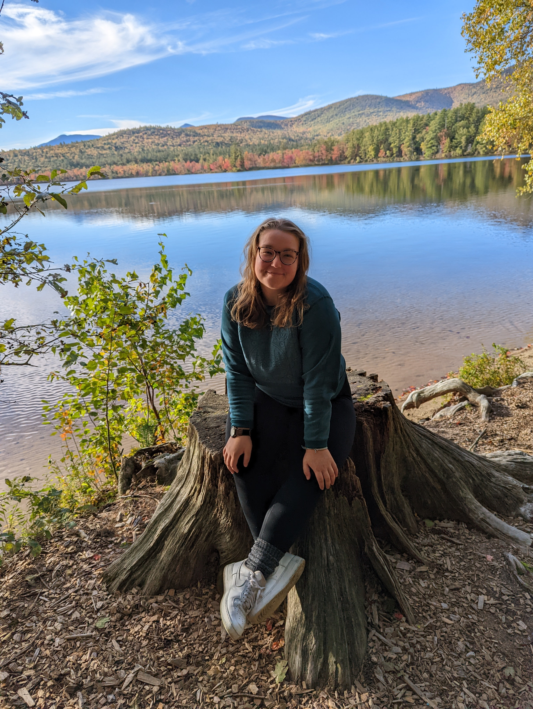

Hello Website!

My name is Callyan Lacio(she/her/hers) and I am pursuing a M.S in Integrative Biology under Dr. Laura Kloepper. My research interests include studying the acoustic ecology of marine mammals. My current projects focus on actual vs perceived biodiversity of bat species in College Woods and estimating the chorusing activity of American Bullfrogs by quantifying total acoustic energy. 

Before coming to UNH, I graduated with my B.S. in Zoology and Conservation Ecology from Friends University in Wichita, Kansas in 2021. During my undergraduate degree I worked on various research projects including Red Ruffed Lemur activity in Madagascar, actual vs perceived natural behaviors in captive Squirrel Monkeys, figuring best active training practices for captive animal veterinary procedures, and the effects of unreleased cancer medications on fruit fly populations. Post-graduation I worked for the Florida Fish & Wildlife Conservation Commission doing rescue and rehabilitation for dolphins and manatees in Tampa, Florida. Once I moved to New Hampshire, I spent time as a Lead Scientist teaching Marine Biology to K-12 on the beaches and I also worked as an Environmental Chemical Analyst studying PFAS (per- and polyfluoroalkyl substances) in local water supplies/recreation areas. 

